<p align="center">
  
</p>

# moquerie

> Effortlessly mock your entire API with simple configuration and a beautiful UI.

Moquerie is a tool that allows you to easily create a fake GraphQL or REST API (or both at the same time). It is designed to be simple to use and easy to configure.

[Continuous Releases ➡️](https://nightly.akryum.dev/akryum/moquerie) | [Demo on StackBlitz ⚡️](https://stackblitz.com/edit/moquerie-demo?file=README.md)

## Main features

- **Local Database** (automatically managed for you)
  - **Deactivate rows** so they are not returned by the API without deleting them
  - **Factories** to create table rows (aka 'Resource Instances') (can be saved and committed to your repository)
  - **Branches** (duplicate or empty)
  - **Snapshots** (full or partial) (can be saved and committed to your repository)
  - History
- Generate database tables (aka 'Resource Types') from GraphQL schema or TypeScript files
- Automatic **RESTful endpoints** (GET, POST, PUT, PATCH, DELETE)
- Automatic **GraphQL server**
- **No-Code read queries** (for GraphQL)
- **Dashboard UI**
- Extensible with `.moq.ts` files or with plugins
- Typed APIs

## Use Cases

- Develop a frontend without needing the backend
- Test while mocking the backend
- Run a fake REST API for demos/workshops

## Sponsors

[Become a sponsor!](https://github.com/sponsors/Akryum)

<p align="center">
  <a href="https://guillaume-chau.info/sponsors/" target="_blank">
    
  </a>
</p>

## Setup

Install the `moquerie` package:

```bash
pnpm install moquerie
```

*(Optional)* Create a `moquerie.config.ts` (or `moquerie.config.js`) file in the root of your project:

```ts
import { defineConfig } from 'moquerie/config'

export default defineConfig({
  // API port
  server: {
    port: 4002,
  },
})
```

## Getting started

### REST Quickstart

*(Optional)* To quickly create a fake REST server, create a `moquerie.rest.ts` file in your project that export resource types:

```ts
// moquerie.rest.ts

export interface MyObject {
  id: string
  title: string
  count: number
}
```

Moquerie will detect this file and automatically create RESTful endpoints for each resource type found within (without any additional configuration).

### GraphQL Quickstart

If you have a GraphQL schema, you can let moquerie scan your code files for graphql schema definitions that uses the `gql` tag.

```ts
// moquerie.config.ts

import { defineConfig } from 'moquerie/config'

export default defineConfig({
  // API port
  server: {
    port: 4002,
  },
  // GraphQL schema
  graphql: {
    schema: {
      scanCodeFiles: './src/schema/**/*.ts',
    },
  },
})
```

You also have several options to configure your GraphQL schema:

- `url`: Live URL to the GraphQL server
- `jsonFile`: Introspection result JSON file
- `graphqlFiles`: `.graphql` files to load, can be a path to a single file or a glob pattern
- `scanCodeFiles`: Glob pattern to scan code files for GraphQL schema definitions that uses the `gql` tag

For REST you don't need additional configuration, but your need to register API Routes.

### Run the server

Run the `moquerie` command to start the server:

```bash
pnpm exec moquerie
```

Open your browser at the UI URL displayed in the console.

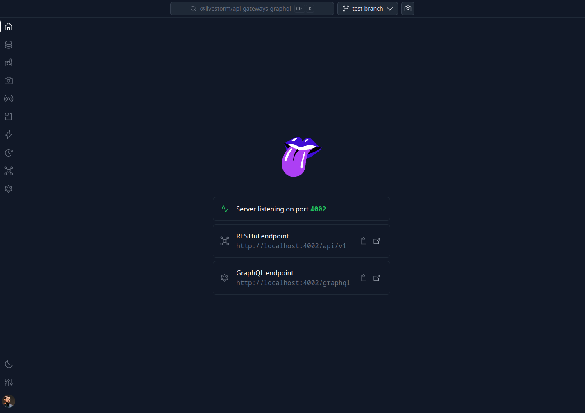

You can see the mocked API endpoints listed here.

### Resource types

By default moquerie will infer resource types from your GraphQL schema. If you don't have one, you can define resource types for your REST API with the `rest.typeFiles` config:

```ts
import { defineConfig } from 'moquerie/config'

export default defineConfig({
  rest: {
    typeFiles: [
      'src/rest/types.ts',
    ],
  },
})
```

With this configuration, moquerie will automatically create RESTful endpoints for each resource types found with:

- `GET /resourceType`: list all instances
  - Filter the results with query parameters, for example `GET /resourceType?name=foo`
  - Paginate with `__page` (first page is `0`) and `__pageSize` (default `10`) query parameters: `GET /resourceType?__page=1&__pageSize=10`
  - Sort with `__sort` query parameter with the syntax `<field>:asc` or `<field>:desc`: `GET /resourceType?__sort=name:asc`
  - Search for text with `__search` query parameter: `GET /resourceType?__search=foo`
- `POST /resourceType`: create a new instance
- `GET /resourceType/:id`: get an instance
- `PUT /resourceType/:id`: update an instance
- `PATCH /resourceType/:id`: update an instance
- `DELETE /resourceType/:id`: delete an instance

Here is an example that demonstrate several supported features such as importing types from other files, optional fields, union types, and deprecated fields:

```ts
import type { MyObjectNotExported } from './other.js'

export interface MyObject {
  id: string
  name: string
  count: number
}

/**
 * Another object
 * @restPath /foo
 */
export interface MyOtherObject {
  id: string
  /**
   * Some useful description
   */
  description?: string
  otherDescription: string | undefined
  thirdDescription: null | string
  objects: MyObject[]
  notExported: MyObjectNotExported
  /**
   * @deprecated Use `otherDescription` instead
   */
  deprecatedField: string
}

/**
 * @deprecated Use `MyOtherObject` instead
 */
export interface OldObject {
  id: string
  name: string
  count: number
}
```

You can also easily extend types for existing resource types (usually from a GraphQL schema)

```ts
import { defineConfig } from 'moquerie/config'

export default defineConfig({
  graphql: {
    schema: {
      scanCodeFiles: './src/**/*.ts',
    },
  },

  extendTypes: {
    typeFiles: [
      'src/extend/types.ts',
    ],
  },
})
```

Here is an example that demonstrate extending a type from a GraphQL schema:

```ts
// Extend the Message type from the GraphQL schema
export interface Message {
  /**
   * Some example property added to the schema
   */
  internalProp: string
}
```

### API Routes

Every code you write for  moquerie should be placed inside files ending with `.moq.ts` (you can change this in the config with `mockFiles`). Moquerie will automatically load these files for you.

In addition to API routes, we can also define resolvers, scripts and much more as described later.

Here is an example of a simple API route:

```ts
// file-name.moq.ts

import { defineApiRoutes, defineResolvers, defineSchemaTransforms, defineScripts } from 'moquerie/mocks'

export default {
  // Define API routes
  ...defineApiRoutes((router) => {
    router.get('/messages/count', () => 42)
  }),
}
```

We recommend using the spread operator to merge the results of the `defineApiRoutes`, `defineResolvers`, `defineSchemaTransforms`, and `defineScripts` functions. For example:

```ts
// file-name.moq.ts

export default {
  ...defineApiRoutes((router) => {
    // Define API routes
  }),
  ...defineResolvers({
    // Define resolvers
  }),
  ...defineSchemaTransforms(({ schema }) => {
    // Define schema transforms
  }),
  ...defineScripts({
    // Define scripts
  }),
}
```

You can use the `router` object to define API routes. The `router` object has a method for each HTTP verb and each handler function receive a useful object as the parameter that allow you to access the database and other utilities.

```ts
// file-name.moq.ts

import { defineApiRoutes, defineResolvers, defineSchemaTransforms, defineScripts } from 'moquerie/mocks'

export default {
  // Define API routes
  ...defineApiRoutes((router) => {
    router.get('/messages/count', async ({ db }) => {
      // There are many more methods available on the context object above
      return (await db.Message.findMany()).length
    })
  }),
}
```

## Database

The Database page is a data explorer in which you can create, read, update, and delete rows (aka 'Resource Instances'). You can also deactivate rows so they are not returned by the API without deleting them.

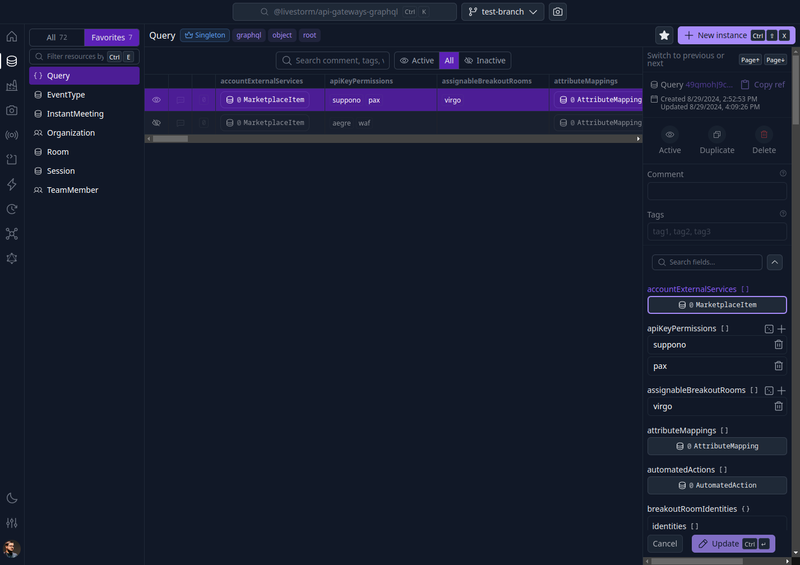

Instances that are active (open eye icon) will be taken into account when querying the API, while inactive instances (slashed eye icon) will be ignored - even if you call the database in resolvers! This is useful for testing different scenarios without having to delete and recreate instances constantly.

You can select an instance to see its details, update it, or deactivate it. You can also select multiple instances to apply bulk changes using the `Shift` key.

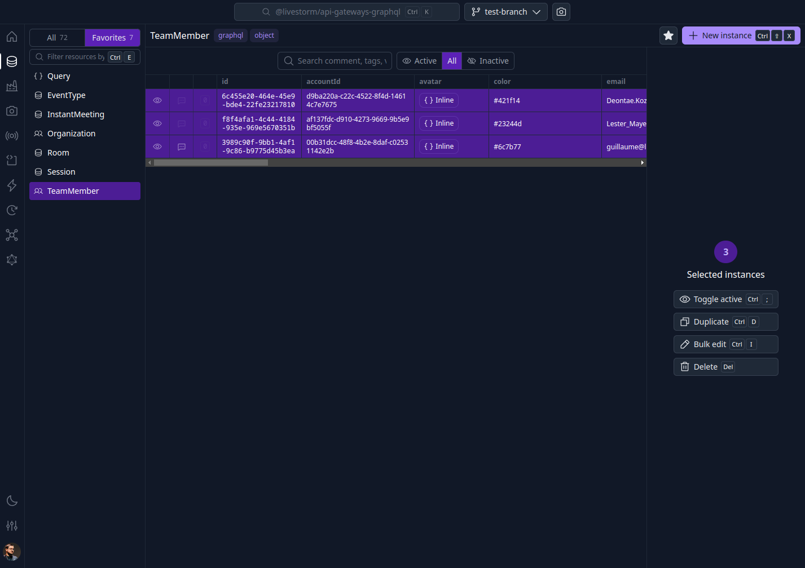

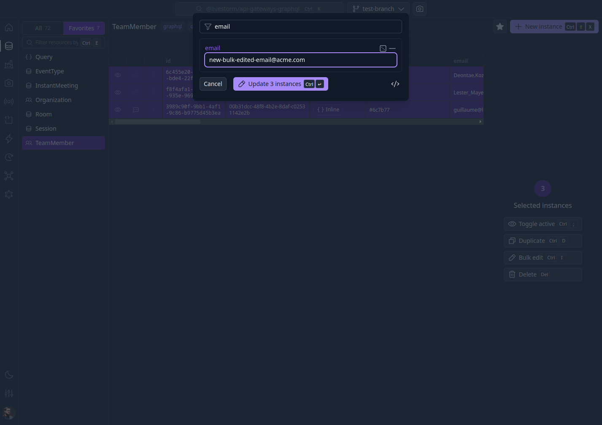

### Branches

To help you switch between different scenarios, you can create branches. Branches are like a copy of the database at a certain point in time. You can create a new branch from the current database, or you can create an empty branch.

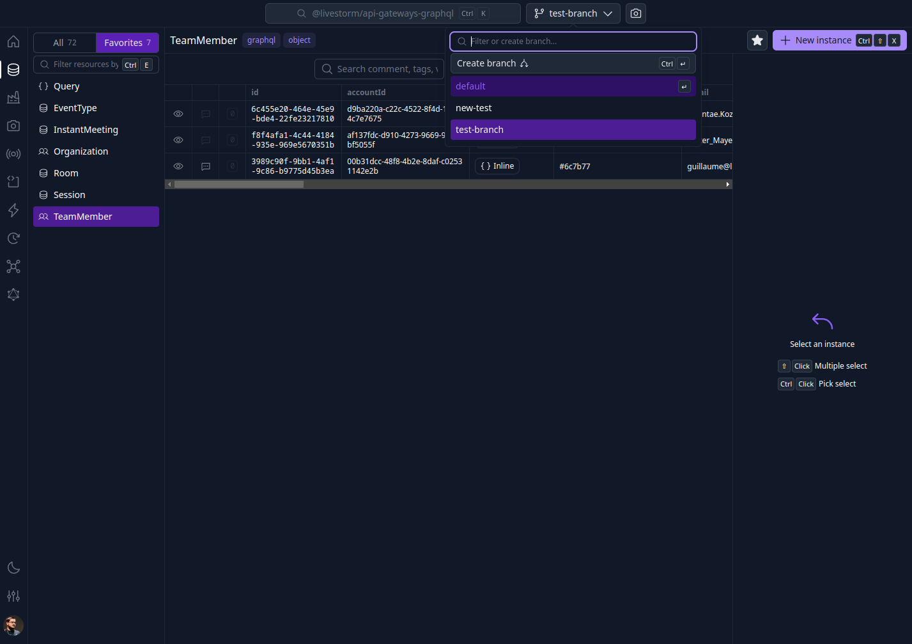

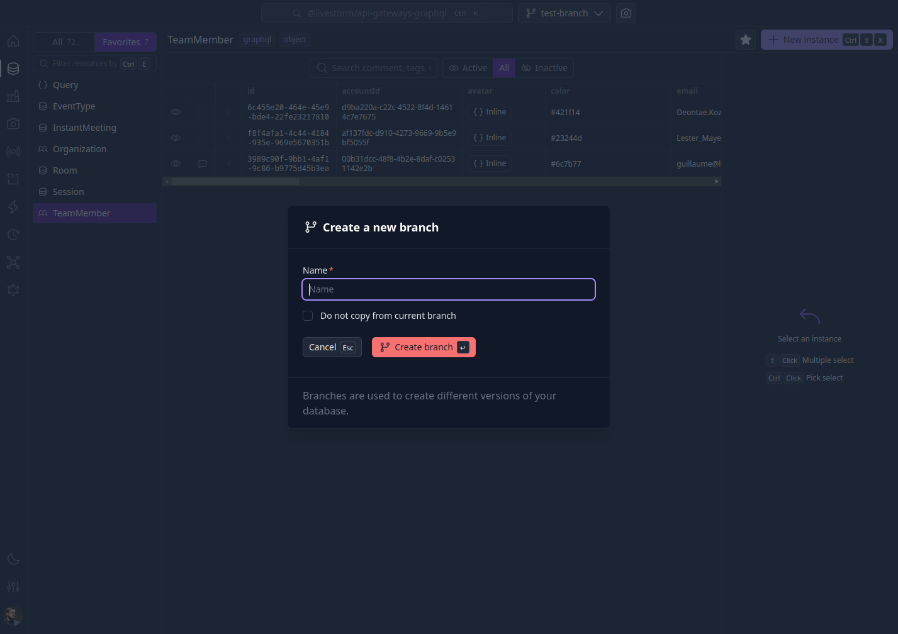

### No-Code GraphQL Queries

Moquerie allows you to query your mocked GraphQL API without writing any code for reading data. Use the `Query` resource that represents the root query type of your GraphQL schema. Your API will automatically use the active `Query` instance to return data for your GraphQL queries.

For example, if you have a `Query` resource with a `hello` field that returns a string, you can query it like this:

```graphql
query {
  hello
}
```

In the Dashboard UI, create a `Query` instance and set the value of the `hello` field to `world`.

> [!TIP]
> It's a  'singleton' resource (it has the `singleton` tag as shown in the UI), meaning you can only have one active instance at a time. If you activate another instance, the previous one will be deactivated automatically.

Now if you run the above query in the GraphQL Playground, you will get the following result:

```json
{
  "data": {
    "hello": "world"
  }
}
```

Any resources referenced in the `Query` instance will be resolved automatically. For example, if the `Query` instance has a `currentUser` field that references a `User` resource, the `User` resource will be resolved and returned as part of the response. To change which `User` resource is returned, you can create a new `User` instance and reference it in the `Query` instance by clicking on the `currentUser` field and adding the newly created `User` instance.

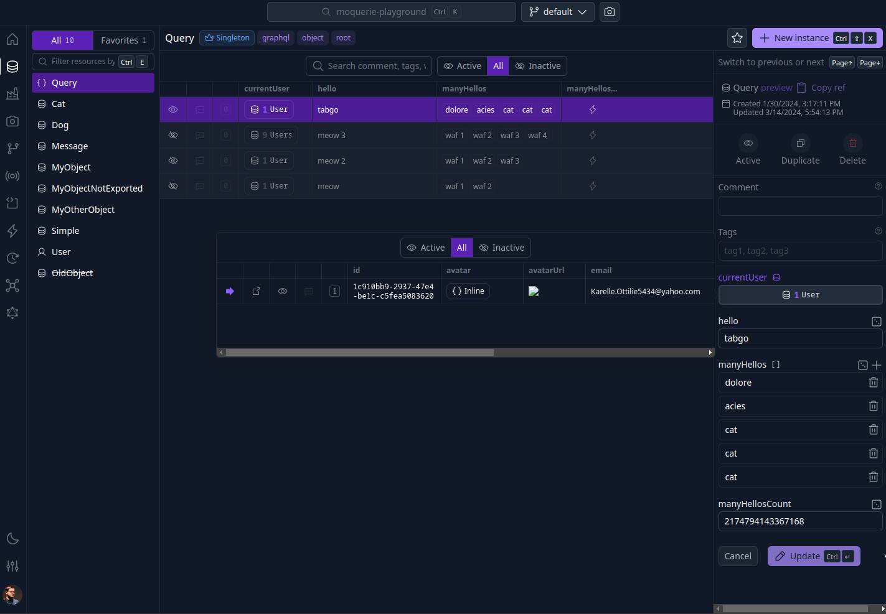

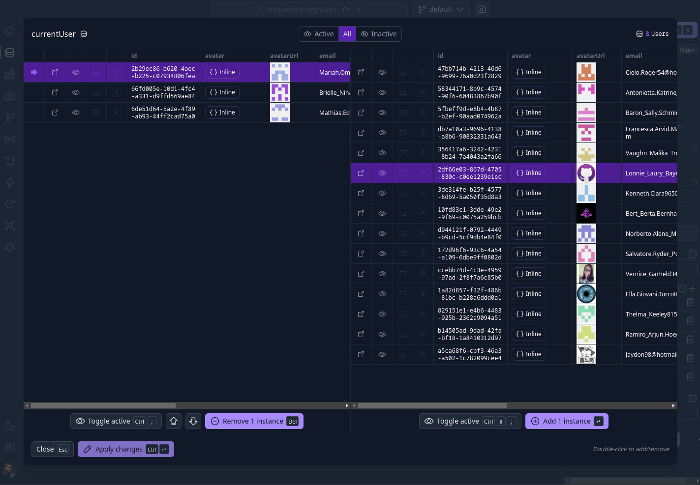

> [!TIP]
> Even if a field is supposed to return a single instance, you can still reference multiple instances. Moquerie will automatically pick the first active instance. You can reorder the instances to change which one is picked first.

## Factories

Factories are simple functions that create a single row (aka 'Resource Instance') in the database. They can be saved and committed to your repository to be easily shared with your team.

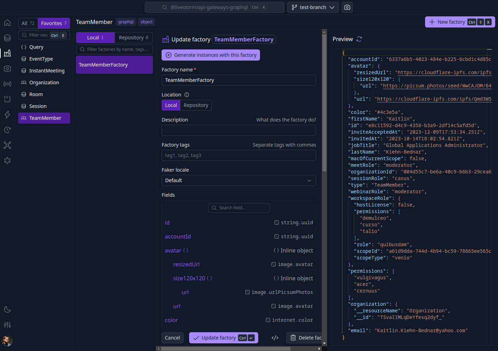

Factories use [faker](https://github.com/faker-js/faker) to generate random data.

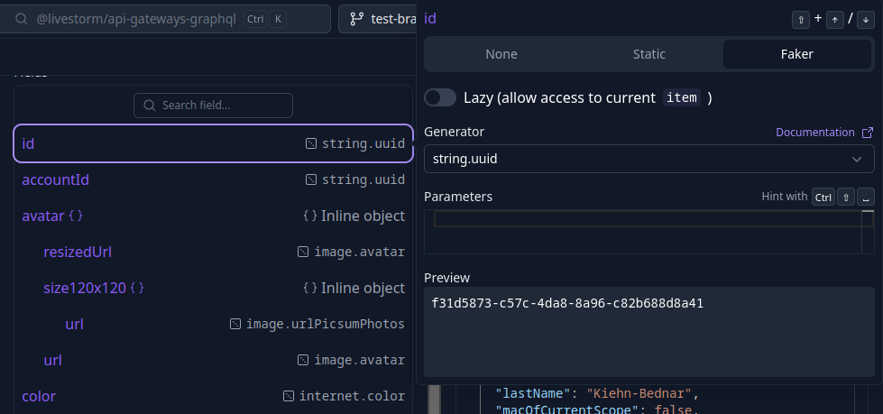

You can then use them to create instances in the database.

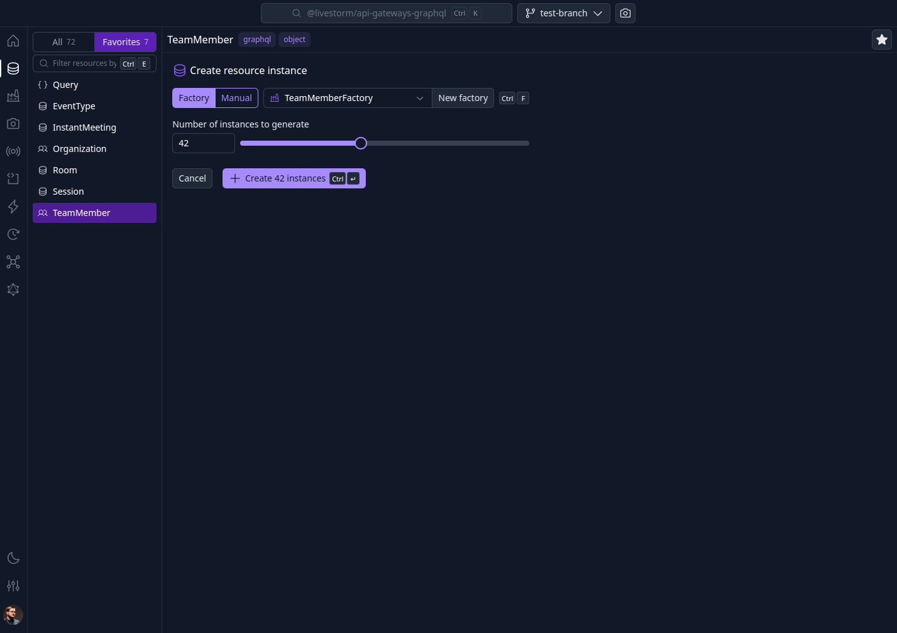

Anytime you can save things to the current repository, you will see a toggle to switch between `Local` and `Repository`.

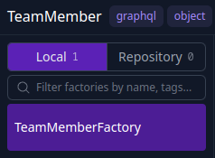

## Snapshots

Snapshots are a way to save the state of the database at a certain point in time. You can save full snapshots or partial snapshots (only some resource instances). Similar to factories, snapshots can be saved and committed to your repository.

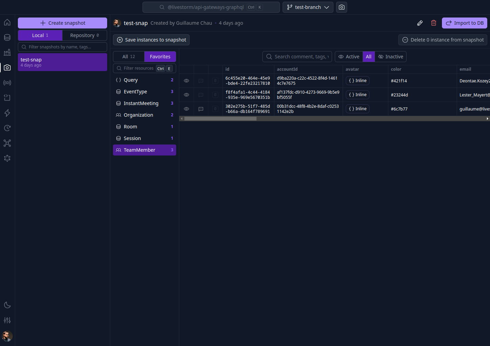

You can then edit, delete or import snapshots to your database. Note that data inside resource instances cannot be directly edited in the snapshot editor.

## PubSub

You can use the PubSub editor to publish real-time events to your API. This is useful for testing subscriptions or other real-time features.

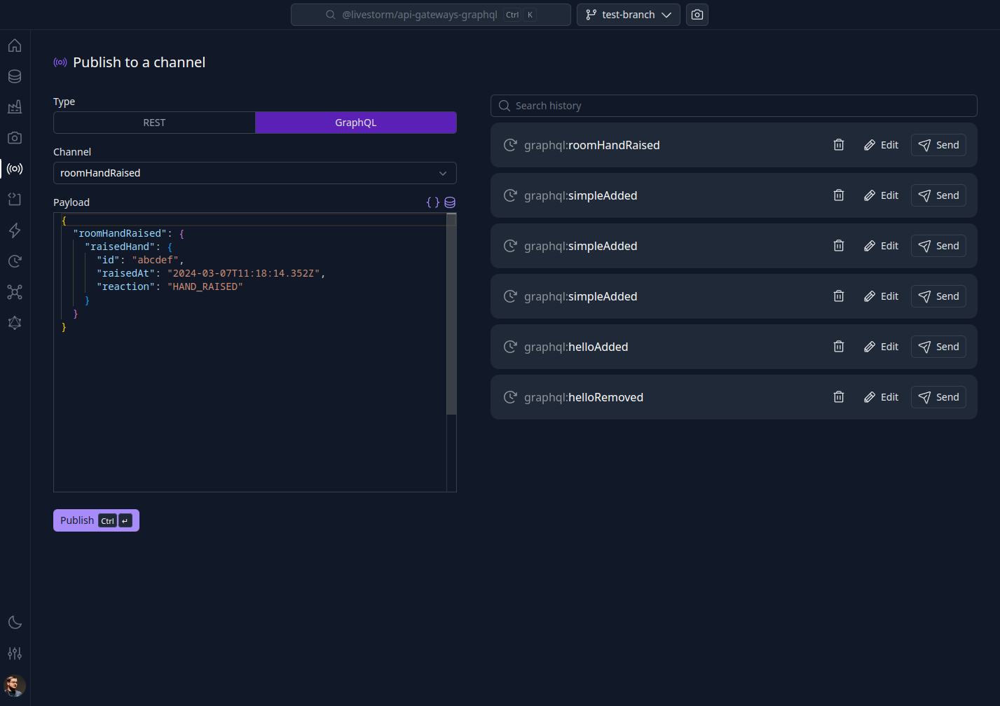

## Scripts

Scripts allows you to create complex scenarios that involve calling multiple factories, database operations and maybe more.

Similar to API Routes, you need to define scripts in `.moq.ts` files.

```ts
// file-name.moq.ts

import { defineScripts } from 'moquerie/mocks'

export default {
  ...defineScripts({
    // Each key is a script
    createSimpleMessage: {
      description: `Create a simple message sent by current user`,
      fn: async ({ generateResource, db }) => {
        // Create message with a Factory
        const [ref] = await generateResource('Message', 'SimpleMessageFactory')

        // Update message with current user
        const me = await db.User.findFirstReference((data, { tags }) => tags.includes('me'))
        if (!me) {
          throw new Error(`User with tag 'me' not found`)
        }
        await db.Message.updateFirst({
          from: me,
        }, (_, instance) => instance.id === ref.__id)
      },
    },
  }),
}
```

You can run scripts from the UI or from the API. In the Dashboard UI, you will see a summary of the operations done by the script or any error that occurred.

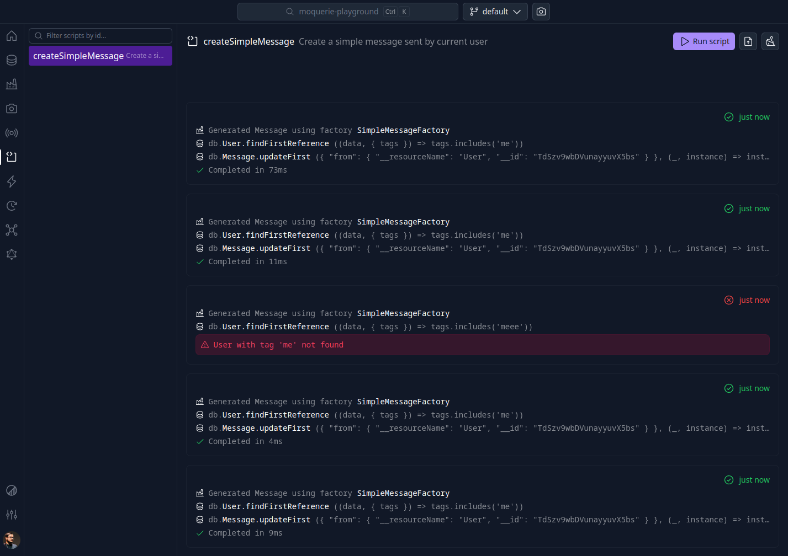

## Resolvers

Resolvers are functions that are called when a query is made to the API. They can be used to customize the response of the API, or to perform complex operations. Each resolver is a function accosiated with a specific field of a specific Resource Type in the schema.

Similar to API Routes and Scripts, you need to define resolvers in `.moq.ts` files.

```ts
import { defineResolvers } from 'moquerie/mocks'

export default {
  ...defineResolvers({
    // Each key is a Resource Type
    // Target type is `Query`
    Query: {
      // Each key is a field of the `Query` type

      // field name is `manyHellosCount`
      manyHellosCount: async ({ db }) => {
        const query = await db.Query.findFirst()
        return query?.manyHellos.length ?? 0
      },
    },

    // Target type is `Mutation`
    Mutation: {
      // Each key is a field of the `Mutation` type

      // field name is `addHello`
      addHello: async ({ input, db, pubsub }) => {
        const query = await db.Query.findFirst()
        const manyHellos = query?.manyHellos ?? []
        manyHellos.push(input.message)
        await db.Query.updateFirst({
          manyHellos,
        })
        pubsub.graphql.publish('helloAdded', {
          helloAdded: input.message,
        })
        return manyHellos
      },

      // field name is `removeHello`
      removeHello: async ({ input, db, pubsub }) => {
        const query = await db.Query.findFirst()
        const manyHellos = query?.manyHellos ?? []
        const index = manyHellos.indexOf(input.message)
        if (index !== -1) {
          manyHellos.splice(index, 1)
          await db.Query.updateFirst({
            manyHellos,
          })
        }
        pubsub.graphql.publish('helloRemoved', {
          helloRemoved: input.message,
        })
        return manyHellos
      },

      testMutation: () => true,

      addSimple: async ({ input, db, pubsub }) => {
        const simple = await db.Simple.create({
          id: input.id,
        })

        // Publish resource instance value

        // Either pass the value directly if it comes from `db`:
        // pubsub.graphql.publish('simpleAdded', {
        //   simpleAdded: simple,
        // })

        // Or pass the reference:
        pubsub.graphql.publish('simpleAdded', {
          simpleAdded: await db.Simple.findFirstReference(s => s.id === simple.id),
        })

        // This will not work as we lose the hidden flag:
        // pubsub.graphql.publish('simpleAdded', {
        //   simpleAdded: {
        //     ...simple,
        //   },
        // })

        return simple
      },
    },

    // Target type is `User`
    User: {
      // field name is `fullName`
      fullName: ({ parent: user }) => `${user.firstName} ${user.lastName}`
    }
  }),
}
```

You can inspect which resolvers are detected by moquerie in the UI.

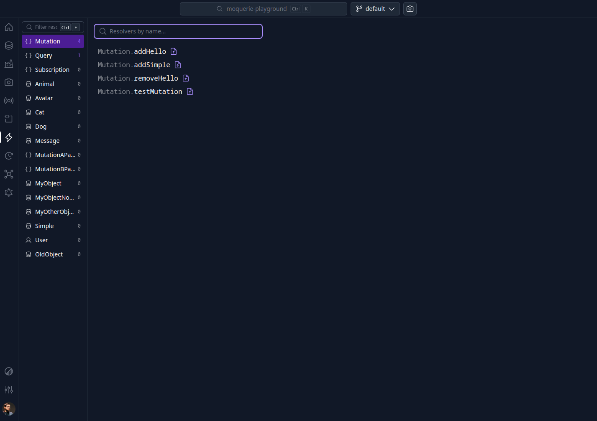

## Database Operations

You can perform database operations in resolvers, scripts and API routes. Usually, you can use the `db` object to interact with the database from the context parameter object.

```ts
import { defineResolvers } from 'moquerie/mocks'

export default {
  ...defineResolvers({
    Query: {
      manyHellosCount: async ({ db }) => {
        // Access the database
        const query = await db.Query.findFirst()
        return query?.manyHellos.length ?? 0
      },
    },
  }),
}
```

Each Resource Type has a set of methods that you can use to interact with the database, using the following pattern:

```ts
const result = await db.ResourceType.methodName(/* Params... */)
```

### Instance References

Resource instances are stored in a single file each. If an instance contains other instances, they are stored as references. A reference looks like this:

```json
{
  "__resourceName": "User",
  "__id": "SamRdWgbjDqv3BN2ZAHky"
}
```

> [!TIP]
> Moquerie will automatically resolve the references when reading resource instances. References will never appear in the result of the database calls, so you can safely use them as response values for your mocked API.

You can get the reference of an instance with the `findFirstReference` method:

```ts
const reference = await db.Messages.findFirstReference(m => m.id === someId)
```

You can then use it to update other instances without getting the full object.

You can also get multiple references with the `findManyReferences` method:

```ts
const references = await db.User.findManyReferences(u => u.email.endsWith('@acme.com'))
```

### Retrieve instances

Find the first instance that matches a condition:

```ts
const user = await db.User.findFirst(u => u.email === 'cat@acme.com')
```

> [!TIP]
> Only active instances are returned by the database. You can deactivate instances to hide them from the API in the dashboard UI.

You can also omit the condition to get the first instance that is active:

```ts
const query = await db.Query.findFirst()
```

There is also a convenience version that throws an error if the instance is not found:

```ts
const user = await db.User.findFirstOrThrow(u => u.email === 'cat@acme.com')
```

Find many instances that match a condition:

```ts
const users = await db.User.findMany(u => u.email.endsWith('@acme.com'))
```

Pick a random instance:

```ts
const user = await db.User.pickOneRandom()
```

Pick multiple random instances:

```ts
// Randomly pick between 1 and 10 user instances
const users = await db.User.pickManyRandom(1, 10)
```

> [!TIP]
> You can also use the `findMany` method to narrow down the results with the filter, then use the `pickRandom` util function from the context object.

### Tags and instance metadata

Usually when there is a condition predicate, you can also use the second parameter (which is the full instance including metadata) to access the tags of the instance:

```ts
const me = await db.User.findFirst((_data, { tags }) => tags.includes('me'))
const userRefs = await db.User.findManyReferences((_u, { tags }) => tags.includes('admin'))
const users = await db.User.findMany((_u, { tags }) => tags.includes('admin'))
```

Tags and other metadata are never included in the result of the Database calls. They are only used to facilitate your queries.

### Update instances

Update the first instance that matches a condition:

```ts
const user = await db.User.updateFirst({
  someProperty: 'newValue',
}, u => u.email === 'cat@acme.com')
```

Or multiple instances:

```ts
const users = await db.User.updateMany({
  someProperty: 'newValue',
}, u => u.email.endsWith('@acme.com'))
```

### Create instances

Create a new instance:

```ts
const user = await db.User.create({
  id: generateId(), // `generateId` is a util from context object
  email: 'cat@acme.com',
})
```

### Delete instances

Delete **all instances** that match a condition:

```ts
await db.User.delete(u => u.email.endsWith('@acme.com'))
```

## History

You can see the history of all the changes made to the database in the History page.

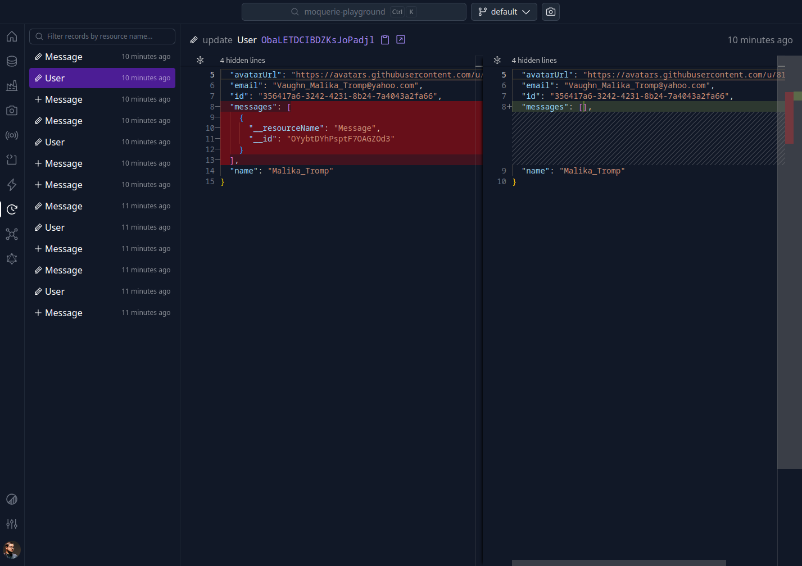

## REST Playground

You can use the REST Playground to test your REST API.

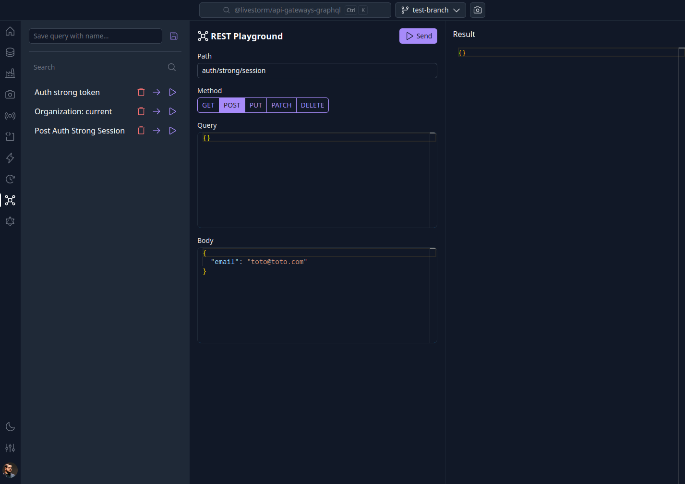

## GraphQL Playground

You can use the GraphQL Playground to test your GraphQL API.

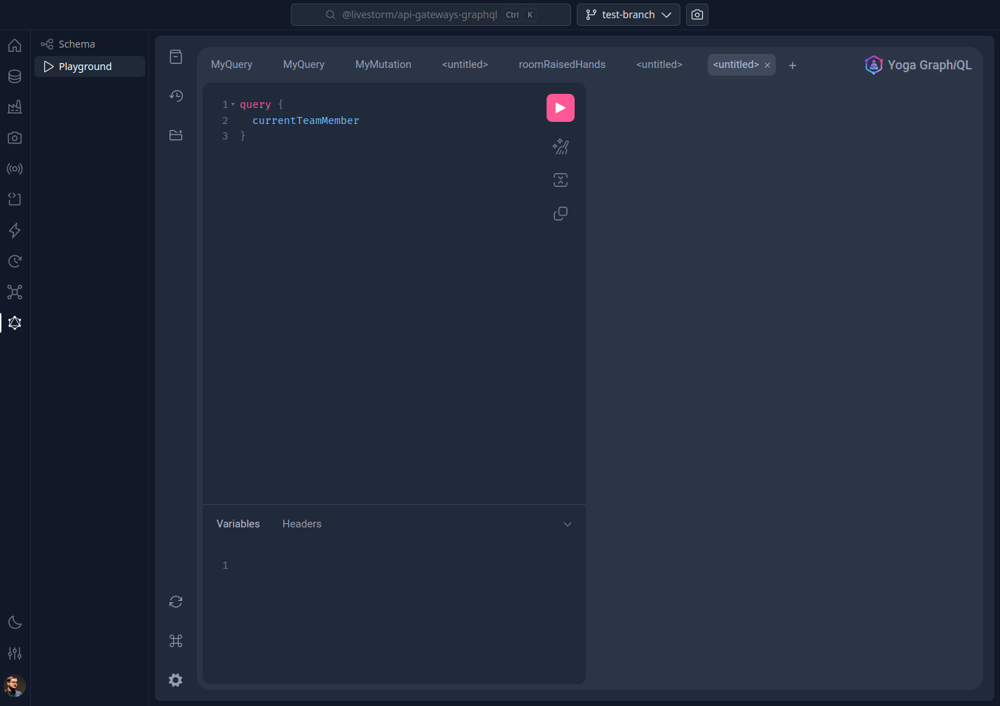

## Schema Transforms

You can make changes to the schema programmatically using schema transforms. This is useful for adding new internal fields for example.

```ts
// file-name.moq.ts

import { defineSchemaTransforms } from 'moquerie/mocks'

export default {
  ...defineSchemaTransforms(({ schema, createEnumField }) => {
    schema.types.User.fields.customInternalField = createEnumField('customInternalField', [
      { value: 1, description: 'One' },
      { value: 2, description: 'Two' },
      { value: 3, description: 'Three' },
    ])
  }),
}
```

## Programmatic API

You can also use moquerie programmatically. You always start by creating an instance of moquerie:

```ts
import { createMoquerieInstance } from 'moquerie'

const mq = await createMoquerieInstance({
  cwd: process.cwd(),
  watching: true,
  skipWrites: false,
})
```

> [!TIP]
> You can set `watching` to `false` and `skipWrites` to `true` to disable watching and writing to the disk during tests.

You can then pass the moquerie instance to most of the functions in the `moquerie` package.

### Start server

This will start the mocked APIs.

```ts
import { startServer } from 'moquerie'

await startServer(mq)
```

### Run a Script

You can run a script by its id (the key used in `defineScripts`).

```ts
import { runScript } from 'moquerie'

const report = await runScript(mq, 'createSimpleMessage')
```

### Call a Factory

```ts
import { createInstanceFromFactory, getFactoryByName } from 'moquerie'

const factory = await getFactoryByName(mq, 'SimpleMessage')
const instance = await createInstanceFromFactory(mq, {
  factory,
  save: true,
})
```

### Use a Snapshot

This will create a new branch from the snapshot.

```ts
import { useSnapshot } from 'moquerie'

await useSnapshot(mq, 'some-snapshot-id')
```

### Get the resolved context

The resolved context of the moquerie instance is useful to access the database, the pubsub, the resource schema, the list of scripts, resolvers, and so on.

```ts
const ctx = await mq.getResolvedContext()
```

### Call the Database

You can call the database the same way you would in a resolver or a script using the resolved context.

```ts
const ctx = await mq.getResolvedContext()
// You can even check for the tags
const me = await ctx.db.User.findFirstReference((data, { tags }) => tags.includes('me'))
```

### Cleanup

You can stop and cleanup the moquerie instance and its server:

```ts
await mq.destroy()
```

## Tests

In your tests you can use the Programmatic API to start the server, run scripts, call factories, and more. This ensures that your app can still make requests to the mocked API even in the test environment.

1. First, create an instance with `createTestInstance`. By default it will disable disk writes and watching.
2. Then you can use an existing snapshot saved to the repository with `useSnapshot` or use factories/scripts defined in your `.moq.ts` files.
3. Finally you can start the server with `startServer`.

After your test run, you can destroy the instance with `destroy`.

```ts
import { afterEach, beforeEach, describe, expect, it } from 'vitest'
import type { MoquerieInstance } from 'moquerie'
import { createTestInstance, startServer, useSnapshot } from 'moquerie'

describe('fetch', () => {
  let mq: MoquerieInstance
  let port: number

  beforeEach(async () => {
    mq = await createTestInstance()
    await useSnapshot(mq, 'vitest')
    const result = await startServer(mq)
    port = result.port
  })

  afterEach(async () => {
    await mq.destroy()
  })

  it('should fetch GraphQL', async () => {
    const response = await fetch(`http://localhost:${port}/graphql`, {
      method: 'POST',
      headers: {
        'Content-Type': 'application/json',
      },
      body: JSON.stringify({
        query: `
          query {
            hello
          }
        `,
      }),
    })
    const data = await response.json()
    expect(data).toEqual({
      data: {
        hello: 'villa',
      },
    })
  })

  it('should fetch REST', async () => {
    {
      const response = await fetch(`http://localhost:${port}/rest/my-object`)
      const data = await response.json()
      expect(data).toEqual({ data: [] })
    }
    await fetch(`http://localhost:${port}/rest/my-object`, {
      method: 'POST',
      headers: {
        'Content-Type': 'application/json',
      },
      body: JSON.stringify({
        id: 'abc',
        name: 'cat',
        count: 42,
      }),
    })
    const response = await fetch(`http://localhost:${port}/rest/my-object`)
    const data = await response.json()
    expect(data).toEqual({
      data: [
        {
          __typename: 'MyObject',
          id: 'abc',
          name: 'cat',
          count: 42,
        },
      ],
    })
  })
})
```

## License

MIT
